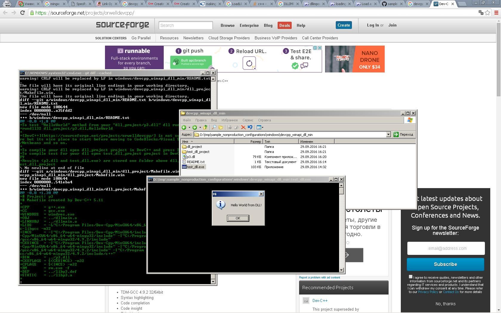

To test "HelloWorld" method from your "dll_project/p3.dll" dll run:
rundll32 dll_project/p3.dll,HelloWorld

[DevC++][https://sourceforge.net/projects/orwelldevcpp/] is not supported anymore but its nice place to start before moving to CodeBlocks/Visual Studio/Eclipse/Netbeans and so on.

To compile your dll open dll_project project in DevC++ and press F9
To compile test for your dll open test_dll_project project in DevC++ and press F9
Results (p3.dll and test_dll.exe) are stored one folder above dll_project and test_dll_project

